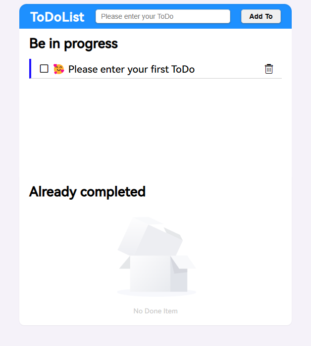
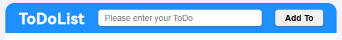

## ToDoList - English

### 操作指南
#### 初始界面

#### 正在进行的例子

  - 点击方框或者文字都可标记为完成
  - 文字较多也可**省略**
    - 
  - 点击右侧删除即可删除

#### 已完成的例子

  - 颜色变灰色，与感知相同
  - 点击对钩或者文字可重新标记为进行中
  - 点击右侧删除即可删除

#### 添加ToDo

  -  在输入框输入事项之后***敲回车***或者点击***右侧按钮***都可添加

#### 正在进行的和已完成的无内容时默认显示空

#### 后台存储用户存储，刷新以及关闭都不会清空数据

#### 整体界面

### 代码解析
#### 目录结构

- CSS 放置页面样式文件，分别为头和正在进行和已完成部分的样式
- icons 放置页面需要的图标
- images 放置页面需要的图片
- js 放置页面需要的js文件

#### 代码大体解析
- 代码采用面向对象的思想，编写 done 和 doing 两个类，分别对应已完成和正在进行的事项，其中都有各自的添加和删除方法，并有相关检查逻辑。
- 读取两个类中存储的数据，循环创建 html 增添到对应的列表。
- 判断后台是否有数据，如果没有第一次使用会有一个默认数据，但使用之后没有数据刷新或者重新打开不会展示默认数据。
- 循环为对应的元素添加方法，用于增添和删除 item，并且再次渲染和重新绑定事件（因为列表变化事件和视图都要变化）。
- 输入框**无内容输入**或者**只输入空格**会提示。
- 后台存储使用 localStorage。
